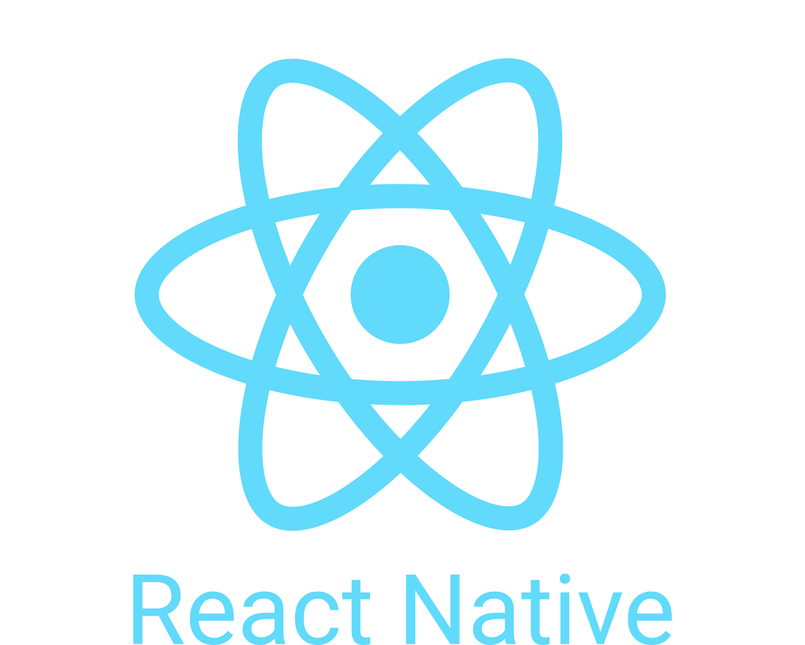
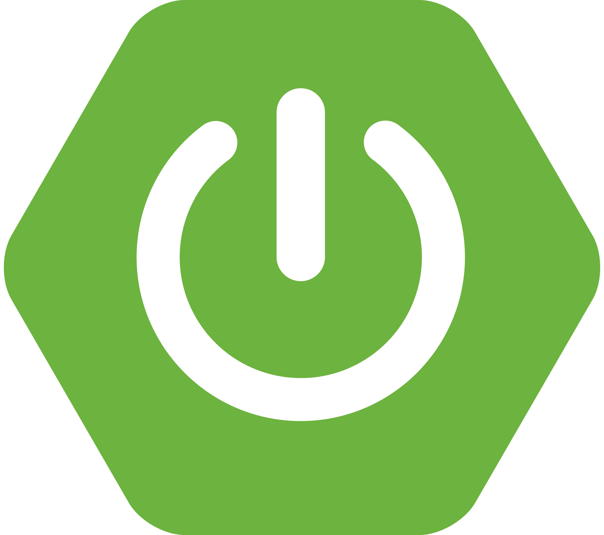
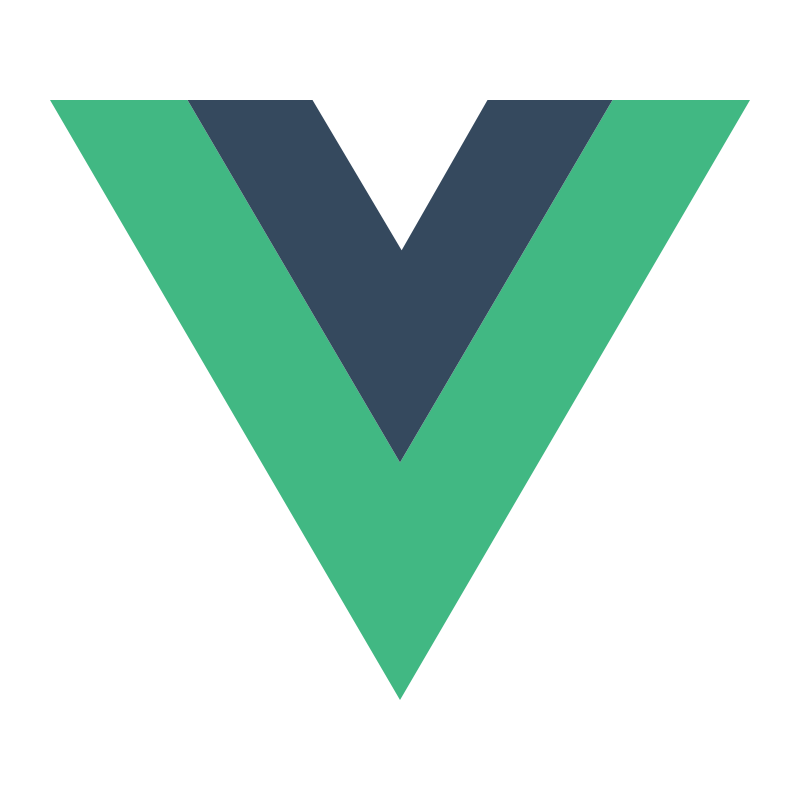

<h1>Welcome to my GitHub</h1>

<h2>
    I'm a Full Stack developer with a love for crafting clean and efficient code. I'm dedicated to continuously learning and improving my skills in various technologies and frameworks
</h2>

    

&nbsp;
    

    

<h3 align="left">💻 Languages:</h3>

    
    
    
    
    

<h3 align="left">📖 Libraries and Frameworks:</h3>

    
    
    
    
    
    
    
    
    
    
    
    
    

<h3 align="left">⚒️ Tools:</h3>

    
    
    
    
    
    
    
    

