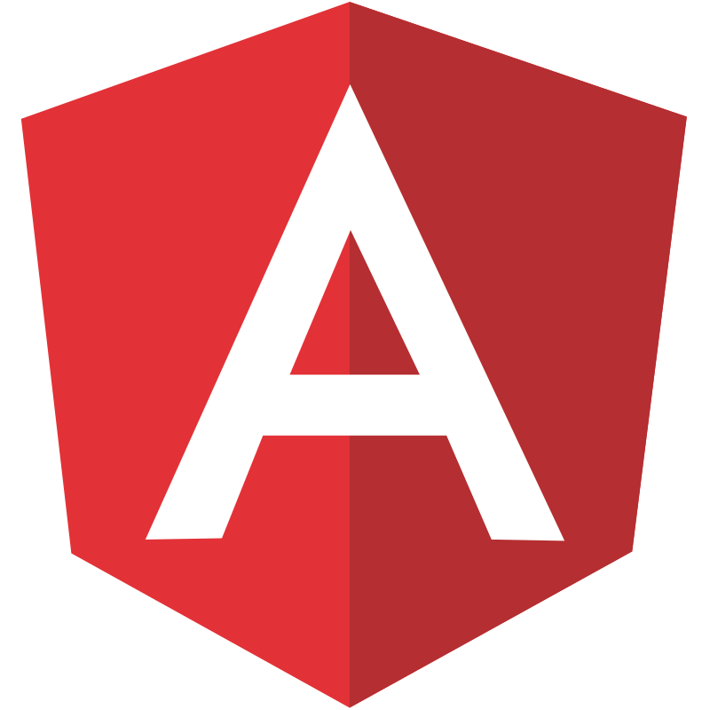
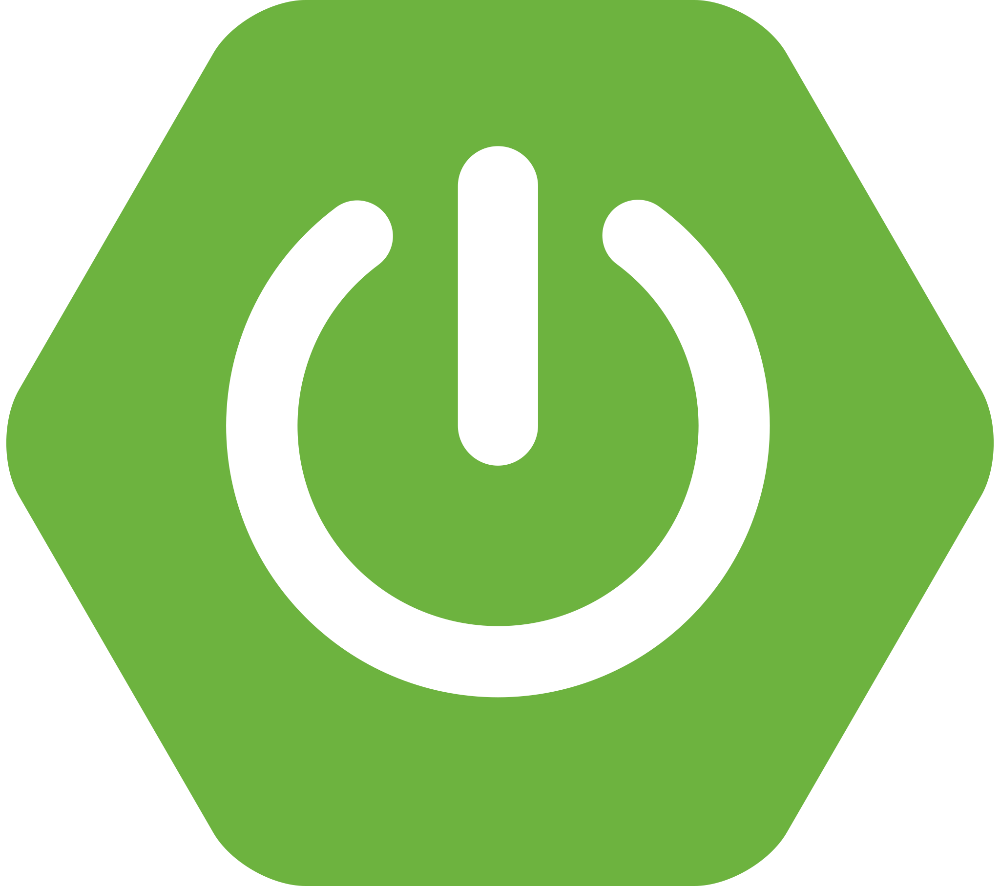
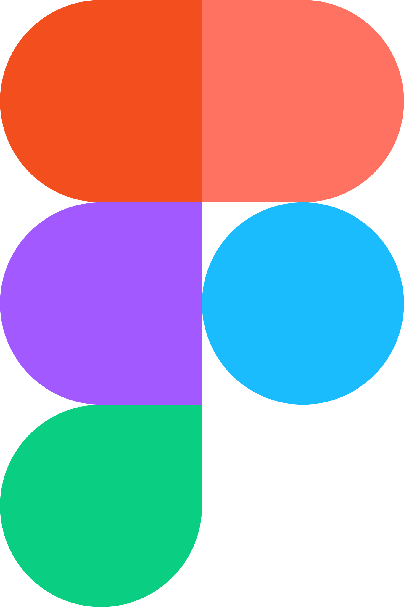

  

  

 

### 👨‍💻 About Me & Experience

Software Engineer specializing in **Web Development**, **QA Automation**, and **System Architecture**. Experienced in delivering scalable solutions, maintaining high-quality testing environments, and exploring low-level **Linux** internals. Active open-source contributor and technical writer at **DevWonders**.

- 🔭 Currently building robust web applications as an **Angular Developer**.
- 🛡️ Previously served as a **QA Engineer**, focusing on:
  - Architecting Automated Testing pipelines (Cypress, Playwright).
  - Requirement validation & managing client communication (US-based clients).
- 🐧 Continuously researching **System Design**, **Architecture**, and low-level software.

### 🚀 Featured Projects & Open Source

- ⚡ **Intel Turbo Boost Fix for Linux**: Utility to restore Intel Turbo Boost on systems where it is disabled by firmware through MSR manipulation.
- 🌍 **Open Source Contributions**: Contributor to `auto-cpufreq` and `Viva New Vegas`.

 

<h3>🛠️ Tech Stack & Tools</h3>

   
  <b>Languages</b> 
  
  
  
  
  
  
  

   
  <b>Libraries & Frameworks</b> 
  
  
  
  
  
  
  
  
  
  
  

   
  <b>Tools & Infrastructure</b> 
  
  
  
  
  
  
  
  

 

<h3>📊 GitHub Stats</h3>

  
  
  

